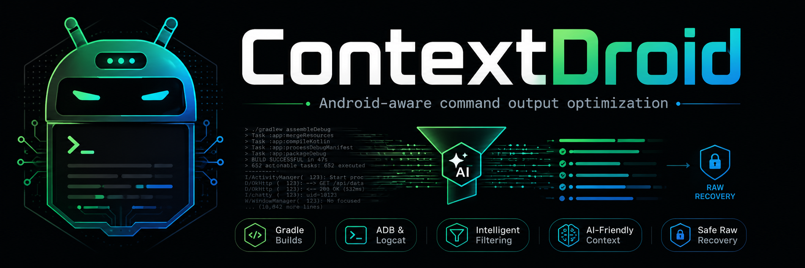

<p align="center">
  
</p>

<p align="center">
  <strong>Turn log chaos into actionable evidence.</strong>
</p>

<p align="center">
  <a href="https://github.com/HawkItzme/ContextDroid/actions/workflows/ci.yml"></a>
  <a href="https://github.com/HawkItzme/ContextDroid/releases/latest"></a>
  <a href="https://opensource.org/licenses/Apache-2.0"></a>
</p>

<p align="center">
  <a href="#quick-start">Quick start</a> &bull;
  <a href="#what-contextdroid-understands">Android coverage</a> &bull;
  <a href="#profiles">Profiles</a> &bull;
  <a href="#raw-recovery">Raw recovery</a> &bull;
  <a href="#agent-integrations">Agent integrations</a> &bull;
  <a href="INSTALL.md">Installation guide</a>
</p>

ContextDroid is an independently maintained, Android-focused command-output optimizer derived
from RTK. It turns verbose Gradle, compiler, ADB, and Logcat output into compact diagnostics for
AI coding agents while preserving the evidence needed to investigate failures.

Complete stdout and stderr are securely staged before parsing. Failed optimized runs are retained
for exact recovery; successful staging is deleted by default. Low-confidence, unknown, structured,
or unsafe output falls back to raw output rather than being guessed at.

## At a glance

| Area | ContextDroid behavior |
|---|---|
| Primary focus | Android builds, tests, devices, crashes, ANRs, and runtime diagnostics |
| Default policy | Conservative `contextdroid-safe` profile with explicit hard stops |
| Failure safety | Original exit behavior, critical fields, causes, and source locations preserved |
| Recovery | Every compact failure includes a run ID and raw-output retrieval command |
| Privacy | Local analytics only; no remote telemetry client or consent flow |
| Distribution | Checksum-verifying installers and release archives; no local Rust build required |

ContextDroid is not affiliated with or endorsed by `rtk-ai`. Upstream provenance and the pinned
RTK commit are recorded in [UPSTREAM.md](UPSTREAM.md); third-party notices are in
[THIRD_PARTY_NOTICES.md](THIRD_PARTY_NOTICES.md).

## Why Android needs a conservative tool

Gradle, AGP, Kotlin, Java, KSP, KAPT, AAPT2, manifest merger, D8/R8, test, ADB, and
Logcat output can be extremely verbose. Blind truncation is dangerous because a useful
root cause may be separated from the failing task, source location, or `Caused by` chain.
ContextDroid captures raw output first, extracts typed diagnostics second, and returns raw
output unchanged whenever parser confidence is low.

## How it works

```text
Android command
      |
      v
Profile-aware safety classifier ---- unsafe or unsupported ----> raw command unchanged
      |
      v
Execute and securely stage complete stdout/stderr
      |
      v
Parse typed diagnostics and validate preservation invariants
      |
      +---- high confidence ----> compact semantic evidence + recovery command
      +---- medium confidence --> evidence + relevant raw context
      `---- low confidence -----> raw output unchanged
```

Raw output is staged before any lossy transformation. Compact output also reports meaningful
omissions, such as successful Gradle tasks or classified framework frames that were collapsed.

## Quick start

Install the latest stable release without Rust or a local build.

Linux and macOS:

```sh
curl -fsSL https://raw.githubusercontent.com/HawkItzme/ContextDroid/main/install.sh | sh
```

Windows PowerShell:

```powershell
irm https://raw.githubusercontent.com/HawkItzme/ContextDroid/main/install.ps1 | iex
```

Use the raw URL exactly as shown; Markdown link syntax such as `[URL](URL)` is not valid
PowerShell input.

Verify the installation and run an Android build:

```text
contextdroid --version
contextdroid gradlew assembleDebug
```

On a compact failure, inspect the preserved output:

```text
contextdroid show <RUN_ID> --raw
```

ContextDroid works directly from the terminal. Agent integration is optional and always a separate,
explicit setup operation.

## Installation and availability

Both installers resolve the latest stable GitHub release, verify `SHA256SUMS`, reject unsafe
redirects and archives, verify the exact binary version, and roll back a failed replacement.
Pin any exact release with `CONTEXTDROID_VERSION`. A custom `CONTEXTDROID_RELEASE_BASE` requires
that explicit version.

Agent integration is a separate explicit operation:

```text
contextdroid setup detect
contextdroid setup preview
contextdroid setup apply --yes
contextdroid setup status
contextdroid setup uninstall --yes
```

Use repeatable `--only <claude|codex|cursor>` to narrow the selection. Cursor requires
`--include-experimental`. Detect, preview, and status never write; apply is transactional and
uninstall removes only managed ContextDroid entries. The older `integrations` commands remain
available throughout 0.1.x.

Direct archives, DEB, and RPM packages are also attached to the GitHub release. Homebrew is
deferred. See [INSTALL.md](INSTALL.md) for pinned, manual, rollback, and source-build options.

## What ContextDroid understands

| Diagnostic family | Examples of preserved evidence |
|---|---|
| Gradle and AGP | Failing task, module, variant, exception, dependency coordinates |
| Kotlin and Java | Exact error, file, line, column, compiler category |
| KSP, KAPT, and Compose | Processor/compiler failure, source location, cause chain |
| Android resources | AAPT2, resource merge/link conflicts, exact resource identifiers |
| Manifest merger | Conflicting manifests, attributes, locations, suggested resolution |
| D8 and R8 | Duplicate classes, shrinker failures, missing rules and references |
| Tests and lint | Failed test, expected/actual values, source frames, lint severity |
| ADB | Devices, install/uninstall, selected `am`, `pm`, and tested `dumpsys` output |
| Logcat | Crash, ANR, StrictMode, Binder/process death, coroutine and native references |

Unsupported Gradle tasks and ADB subcommands pass through unchanged. Binary streams—including
screenshots, APK payloads, bugreport archives, and push/pull byte streams—are never transformed.

## Direct usage

```text
contextdroid gradlew assembleDebug
contextdroid gradlew testDebugUnitTest
contextdroid adb devices
contextdroid adb install app-debug.apk
contextdroid logcat snapshot --mode crash --package com.example.app --since 10m
contextdroid logcat stream --package com.example.app
```

Unsupported commands are not automatically transformed. In safe profiles, call inherited
compatibility commands explicitly only when you understand their output behavior.

## Profiles

| Profile | Intended use | Automatic consideration |
|---|---|---|
| `contextdroid-safe` | Recommended default | Verified Android commands and narrow human-readable Git status/log forms |
| `android-only` | Android-only teams or strict projects | Verified Gradle, ADB, and Logcat commands only |
| `rtk-compatible` | Opt-in inherited compatibility | Broader inherited coverage, still bounded by universal hard stops |

Select the rewrite profile before the subcommand, for example
`contextdroid --profile android-only rewrite "./gradlew assembleDebug"`. The `gain` and
`quality` subcommands use their own `--profile` execution filter. Select output with `--output-mode`,
`CONTEXTDROID_OUTPUT_MODE`, or `[output].mode` (in that precedence). Pipelines, redirects,
substitutions, structured/full output, security tools, downloads, binary protocols,
unknown commands, and broad discovery/read operations pass through unchanged.

## Output modes

| Mode | Behavior | When to use it |
|---|---|---|
| `lossless` | Removes no unique diagnostic facts | Audits, unfamiliar failures, or maximum context |
| `balanced` | Collapses classified chatter while retaining failure evidence | Default day-to-day use |
| `aggressive` | Produces the smallest actionable result with raw recovery | Explicitly selected, well-understood output |

Verbose flags such as `--stacktrace`, `--full-stacktrace`, `--info`, `--debug`, and
`--scan` select raw/lossless behavior.

## Raw recovery

Every failed optimized run stores `metadata.json`, `diagnostics.json`, `summary.txt`,
`stdout.log`, and `stderr.log`. Successful raw staging is deleted unless
`CONTEXTDROID_RETAIN_SUCCESSES=1` is explicitly set. Compact failures include a run ID.

```text
contextdroid show <RUN_ID>
contextdroid show <RUN_ID> --errors
contextdroid show <RUN_ID> --warnings
contextdroid show <RUN_ID> --causes
contextdroid show <RUN_ID> --json
contextdroid show <RUN_ID> --raw
contextdroid runs prune
contextdroid runs list
contextdroid runs purge --yes
```

Stdout and stderr are stored separately. Raw replay labels streams because their original
cross-stream interleaving cannot be reconstructed reliably after process completion.

## Analytics

Analytics are local-only in `analytics.db`; ContextDroid contains no remote telemetry
client or consent flow.

```text
contextdroid gain
contextdroid gain --scope android
contextdroid gain --command gradle --project . --profile contextdroid-safe --parser android-gradle --since 2h
contextdroid gain --weekly --last 20 --format json
contextdroid quality
contextdroid quality --scope android --format json
contextdroid session
contextdroid discover
contextdroid analytics export --format csv
contextdroid analytics reset --yes
contextdroid privacy status
```

Token figures are estimates. Direct command-output reduction and effective reduction after
raw recoveries are reported separately; neither is a claim about complete model-session
billing.

## Agent integrations

ContextDroid keeps installation and agent integration separate. Preview the exact managed change
before applying it:

```text
contextdroid setup detect
contextdroid setup preview
contextdroid setup apply --yes
contextdroid setup status
contextdroid setup uninstall --yes
```

| Agent | Status | Integration method |
|---|---|---|
| Claude Code on Linux | Supported | `PreToolUse` input replacement |
| Codex | Supported, guidance-only | Bounded managed `AGENTS.md` instructions |
| Cursor | Experimental, opt-in | Cursor hooks schema v1 |

Codex integration does not claim transparent command interception. Cursor requires
`--only cursor --include-experimental`. Lifecycle tests require unrelated settings to be
preserved and operations to be idempotent. Direct `contextdroid integrations <agent> ...`
remains compatible throughout 0.1.x.

## ContextDroid and RTK

ContextDroid retains useful RTK infrastructure but makes different product choices:

| | ContextDroid | RTK |
|---|---|---|
| Product scope | Android-focused diagnostics and evidence preservation | Broad general-purpose CLI output optimization |
| Default rewrite posture | Conservative, confidence-gated, Android-aware | Broad command-family coverage |
| Unknown or unsafe output | Raw pass-through | Depends on RTK command/filter behavior |
| Raw recovery | Structured run store for compact failures | RTK-specific recovery mechanisms |
| Analytics | Local-only, including confidence and recovery quality proxies | RTK analytics model |
| Compatibility | Explicit `rtk-compatible` profile; no `rtk` alias | Native RTK behavior |

ContextDroid is pinned to the RTK version and commit documented in [UPSTREAM.md](UPSTREAM.md);
current RTK documentation may describe features added after that pin.

## RTK migration

There is no `rtk` binary alias. Migration is explicit and dry-run by default:

```text
contextdroid migrate rtk --dry-run
contextdroid migrate rtk --apply
```

Only safe preferences and compatible local analytics are imported. Trust state, telemetry
state, and database path overrides are never imported. Recognized RTK hooks make ordinary
integration install fail closed; explicit apply backs up and replaces only recognized entries.
See [docs/MIGRATION.md](docs/MIGRATION.md).

## Safe defaults and exclusions

ContextDroid never automatically rewrites broad `grep`, `rg`, `find`, `tree`, file reads,
full `git diff`, `curl`, `wget`, security scans, machine-consumed JSON/XML/CSV/protobuf,
pipelines, redirected commands, or binary output. Unknown or malformed output is raw.

## Benchmarks

ContextDroid does not reuse RTK percentage claims. The v0.1 corpus measures estimated raw
and returned tokens, preservation, confidence, fallback, recovery/rerun behavior, latency,
and memory. Current results and the methodology are in
[docs/BENCHMARKS.md](docs/BENCHMARKS.md). Correctness gates block release; compression
percentage does not.

## Limitations

- Android diagnostic formats vary across Gradle, AGP, Kotlin, devices, and OEMs.
- The parser corpus is primarily synthetic and must expand with redistributable real-world
  samples.
- Durable optimized output is returned after raw capture completes; live transformed
  streaming remains future work.
- Release archives are verified on their native Linux, macOS, and Windows CI runners.
- Android parser coverage combines redistributable fixtures, an Android Gradle smoke project,
  and a pinned public validation project; device and OEM formats will continue to expand.
- Homebrew remains deferred and is not required for direct stable installation.

## Troubleshooting and uninstall

Use `contextdroid show <RUN_ID> --raw` whenever a summary appears incomplete. Select
`android-only` to disable general inherited automatic coverage, or invoke the original
command directly. Remove managed integration state with `contextdroid setup uninstall --yes`.
Delete the binary and the platform ContextDroid data directory only after
retaining any raw runs you need.

| Symptom | Recommended action |
|---|---|
| Summary appears incomplete | `contextdroid show <RUN_ID> --raw` |
| Need only Android rewriting | Select the `android-only` profile |
| Command should not be transformed | Run it directly or use a safe-profile exclusion |
| Agent setup is unexpected | Run `contextdroid setup status`, then preview/uninstall managed entries |
| Installation or PATH problem | Follow [INSTALL.md](INSTALL.md) and verify `contextdroid --version` |

## Documentation map

| Document | Purpose |
|---|---|
| [INSTALL.md](INSTALL.md) | Install, pin, verify, roll back, and uninstall |
| [docs/ARCHITECTURE.md](docs/ARCHITECTURE.md) | Runtime pipeline and system boundaries |
| [docs/SAFETY_CONTRACT.md](docs/SAFETY_CONTRACT.md) | Preservation invariants and fallback rules |
| [docs/FILTER_MATRIX.md](docs/FILTER_MATRIX.md) | Supported, explicit-only, and pass-through commands |
| [docs/BENCHMARKS.md](docs/BENCHMARKS.md) | Corpus, methodology, measurements, and limitations |
| [docs/INTEGRATIONS.md](docs/INTEGRATIONS.md) | Agent setup lifecycle and platform support |
| [docs/MIGRATION.md](docs/MIGRATION.md) | Explicit migration from recognized RTK state |

## Contributing

Read [CONTRIBUTING.md](CONTRIBUTING.md), [docs/ARCHITECTURE.md](docs/ARCHITECTURE.md), and
[docs/SAFETY_CONTRACT.md](docs/SAFETY_CONTRACT.md). Repository builds, tests, diffs, logs,
and diagnostics must be run raw—never through RTK or ContextDroid. Every parser/rewrite
change needs raw fixtures, semantic assertions, malformed/unknown cases, exit parity,
recovery, and positive/negative rewrite tests.

## License

Apache License 2.0. Existing upstream copyright and license notices are preserved.
